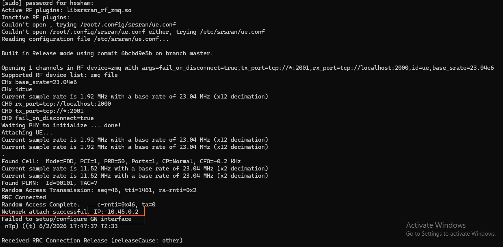

# Building a Full LTE Network using srsRAN + Open5GS with over WSL (No SDR Required)

<p></p>
## Introduction
This project documents the complete implementation of a fully functional LTE network running entirely on a single laptop without any SDR hardware. The lab combines srsRAN 4G for the radio access network and Open5GS for the EPC core, interconnected through ZeroMQ virtual RF, and deployed inside WSL (Windows Subsystem for Linux).

What makes this lab particularly valuable is that it does not stop at a basic attach demonstration. Instead, it recreates a modern EPC architecture using CUPS (Control and User Plane Separation), the same design principle used in real operator networks today.

This setup allowed you to validate the below:
* S1AP signaling between eNB and MME
* NAS Attach procedure
* Subscriber authentication via HSS
* Session establishment via PGW-C(SMF).
* GTP-U tunnel creation via PGW-U(UPF).
* IP address allocation from EPC.
* Linux TUN/TAP integration.
* Deep troubleshooting of control plane vs user plane behavior.

All of these will be achieved without SDR hardware.

<br>

## Architectural Concept Applying CUPS in the Lab

In legacy EPC, the PGW handled both control and user plane. In modern networks, this is separated:

|Function|Open5GS Component|Plane|
|----|----|----|
|Mobility Management|MME|Control|
|Subscriber Database|HSS|Control|
|Session Management (SGW-C)|SGWC|Control|
|User Data Serving Gateway(SGW-U)|SGWU|User|
|Session Management (PGW-C)|SMF|Control|
|User Data Forwarding (PGW-U)|UPF|User|
|Radio Access|srsENB|Access|
|UE|srsUE|Access|
||||


In 5G Core the function of PGW-C resident in SMF and PGW-U function resident in UPF in order to deploy a real CUPS EPC:


## Topology on a Single Host
Because all components run on the same machine, we will use the loopback addressing in order to separate network elements logically.

**Open5GS** 
|Node|IP Address|
|--|--|
|MME	|127.0.0.2|
|SGWC|127.0.0.3|
|SGWU|127.0.0.6|
|PGW-U (UPF)|	127.0.0.7|
|PGW-C (SMF)	|127.0.0.4|
|HSS|127.0.0.8|
|PCRF|127.0.0.9|
|||

Open5GS internally implements this separation exactly as defined by 3GPP and this enables independent processes to communicate exactly as if they are on different servers.


Please refer to the diagram from Open5gs [website](https://open5gs.org/open5gs/docs/guide/01-quickstart/)


To install Open5GS please refer to [Quick start](https://open5gs.org/open5gs/docs/guide/01-quickstart/) or [Building Open5GS from Sources](https://open5gs.org/open5gs/docs/guide/02-building-open5gs-from-sources/)

## **Access Network:**

## Virtual RF using ZeroMQ (No SDR)

As we are going to use **srsenb** as eNB and **srsue** as UE, we will use Zero-MQ to emulate RF (fake RF), which allows UE to set-up a virtual end-to-end network without the use of physical RF-hardware.

To install Zero-MQ, please follow the procedure [here](https://docs.srsran.com/projects/4g/en/latest/app_notes/source/zeromq/source/index.html#zeromq-appnote).

To install srsENB and srsUE,follow the srsRAN [documentation](https://docs.srsran.com/projects/4g/en/latest/general/source/1_installation.html#package-installation).


## Critical Parameter Alignment
For LTE attach to work, the following parameters must match in srsUE, srsENB, Open5GS MME, HSS subscriber:
* MCC = 001
* MNC = 01
* TAC = 7
* PCI = 1
* DL EARFCN = 3350
* PRB = 50
If there is a misconfiguration even one value,It will cause UE attach failure.

In HSS webUI, add the below subscribere information.  
* algo = milenage
* opc = E8ED289DEBA952E4283B54E88E6183CA
* k = 465B5CE8B199B49FAA5F0A2EE238A6BC
* imsi = 001010000000001
* imei = 353490069873319


## Open5GS CUPS Configuration

In ```/etc/open5gs/mme.yaml``` file change the configuration of MME as below.
```
mme:
  freeDiameter: /etc/freeDiameter/mme.conf
  s1ap:
    server:
      - address: 127.0.0.2    # MME address
  gtpc:
    server:
      - address: 127.0.0.2    # MME address
    client:
      sgwc:
        - address: 127.0.0.3    # SGW-C address
      smf:
        - address: 127.0.0.4    # SMF (PGW-C) address

  metrics:
    server:
      - address: 127.0.0.2    
        port: 9090
  gummei:
    - plmn_id:
        mcc: 001
        mnc: 01
      mme_gid: 2
      mme_code: 1
  tai:
    - plmn_id:
        mcc: 001
        mnc: 01
      tac: 7

```
<br>

In ```/etc/open5gs/sgwc.yaml``` file change the configuration of SGW-C as below.

```
sgwc:
  gtpc:
    server:
      - address: 127.0.0.3
    client:
      smf:
        - address: 127.0.0.4
  pfcp:
    server:
      - address: 127.0.0.3
    client:
      sgwu:
        - address: 127.0.0.6
```
<br>
In ```/etc/open5gs/sgwu.yaml``` file change the configuration of SGW-U as below.

```
sgwu:
  pfcp:
    server:
      - address: 127.0.0.6
  gtpu:
    server:
      - address: 127.0.0.6
```
<br>
In ```/etc/open5gs/smf.yaml``` file change the configuration of SMF as below.

```

smf:

  pfcp:
    server:
      - address: 127.0.0.4    
    client:
      upf:
        - address: 127.0.0.7    # UPF (PGW-U) address
  gtpc:
    server:
      - address: 127.0.0.4
      # The MME needs the PGW GTP-C address to inform the Serving Gateway (SGW) where to create the S5/S8 tunnel during a session setup.
  gtpu:
    server:
      - address: 127.0.0.4
  metrics:
    server:
      - address: 127.0.0.4
        port: 9090
  session:
    - subnet: 10.45.0.0/16
      gateway: 10.45.0.1
      dnn: internet
  dns:
    - 8.8.8.8
    - 8.8.4.4
  
```


In ```/etc/open5gs/upf.yaml``` file change the configuration of UPF as below.

```
upf:
  pfcp:
    server:
      - address: 127.0.0.7
    client:
      smf:
        - address: 127.0.0.4
  gtpu:
    server:
      - address: 127.0.0.7
  session:
    - subnet: 10.45.0.0/16
      gateway: 10.45.0.1
      dnn: internet
```
<br>


UPF creates the interface ```ogstun```  10.45.0.1/16.
This is the EPC user plane tunnel.


## eNB RF configuration
After installing and building srsRAN, it would be better to copy the configuration files ( enb.conf, rr.conf, rb.conf, sib.conf, ue.conf) from ```srsRAN_4G/srsenb/``` and ```srsRAN_4G/srsue/``` to ```/etc/srsran/``` directory.

Then start configuring the ```/etc/srsran/enb.conf``` file as shown below.
```
[enb]
enb_id = 0x19B
mcc = 001
mnc = 01
mme_addr = 127.0.0.2    
gtp_bind_addr = 127.0.0.1
s1c_bind_addr = 127.0.0.1
s1c_bind_port = 0
n_prb = 50
name = srsenb01

[enb_files]
sib_config = sib.conf
rr_config  = rr.conf
rb_config = rb.conf

device_name = zmq
device_args = fail_on_disconnect=true,tx_port=tcp://*:2000,rx_port=tcp://localhost:2001,id=enb,base_srate=23.04e6

[rf]
dl_earfcn = 3350
tx_gain = 80
rx_gain = 40

[log]
all_level = warning
all_hex_limit = 32
filename = /tmp/enb.log
file_max_size = -1

[gui]
enable = false
``` 
<br>
Configure the UE by editing ```/etc/srsran/ue.conf``` file as shown below.

```
# Example for ZMQ-based operation with TCP transport for I/Q samples
device_name = zmq
device_args = fail_on_disconnect=true,tx_port=tcp://*:2001,rx_port=tcp://localhost:2000,id=ue,base_srate=23.04e6

[log]
all_level = info
phy_lib_level = none
all_hex_limit = 32
filename = /tmp/ue.log
file_max_size = -1

[usim]
# Remember to configure this information on HSS in Open5GS.
mode = soft
algo = milenage
opc  = E8ED289DEBA952E4283B54E88E6183CA
k    = 465B5CE8B199B49FAA5F0A2EE238A6BC
imsi = 001010000000001
imei = 353490069873319

[nas]
apn = internet
apn_protocol = ipv4

[gw]
netns = ue1
ip_devname = tun_srsue
ip_netmask = 255.255.0.0
```
<br>
Args should be set so that ZMQ is used and two Tx/Rx TCP port pairings are created for the UL and DL.

This creates a virtual RF connection between UE and eNB.

**eNB RF configuration**:
<br>tx_port=tcp://*:2000
<br>rx_port=tcp://localhost:2001

**UE RF configuration**:<br>
tx_port=tcp://*:2001<br>
rx_port=tcp://localhost:2000

You can play and custamize the srseNB and srsUE upon your test case if you know what do.


## Running the 4G End-to-end System 
Before launching the LTE network components on a single machine (WSL) we need to make sure of the below.

* All services of the involved EPC components are running normally.
```
lab:~$  sudo systemctl list-units | grep open5gs
  open5gs-hssd.service       loaded active running   Open5GS HSS Daemon
  open5gs-mmed.service       loaded active running   Open5GS MME Daemon
  open5gs-pcrfd.service      loaded active running   Open5GS PCRF Daemon
  open5gs-sgwcd.service      loaded active running   Open5GS SGW-C Daemon
  open5gs-sgwud.service      loaded active running   Open5GS SGW-U Daemon
  open5gs-smfd.service       loaded active running   Open5GS SMF Daemon
  open5gs-upfd.service       loaded active running   Open5GS UPF Daemon
  open5gs-webui.service      loaded active running   Open5GS WebUI
```
* The IP Forwarding function is enabled on EPC(UPF) by uncomment the line ```net.ipv4.ip_forward=1``` in ```/etc/sysctl.conf```.
then aplly the change by execute ```sudo sysctl -p```.
* Verify ```ogstun``` Interface after Open5GS starting

```
lab:~$ ifconfig
ogstun: flags=4305<UP,POINTOPOINT,RUNNING,NOARP,MULTICAST>  mtu 1400
        inet 10.45.0.1  netmask 255.255.0.0  destination 10.45.0.1
        RX packets 49  bytes 4062 (4.0 KB)
        RX errors 0  dropped 0  overruns 0  frame 0
        TX packets 62  bytes 5076 (5.0 KB)
        TX errors 0  dropped 0 overruns 0  carrier 0  collisions 0
```
* Verify the NAT-ing which tells Linux to perform source NAT (masquerading) on traffic from the UE subnet, but only when it goes out to interfaces other than ogstun.
```
sudo iptables -t nat -A POSTROUTING -s 10.45.0.0/16 ! -o ogstun -j MASQUERADE
sudo iptables -t nat -L -n -v
```

* Verify whether the TUN Device is exist or not.
```
  sudo ls -l /dev/net/tun
```
  If not exist:
  
```
  sudo modprobe tun
  sudo mkdir -p /dev/net
  sudo mknod /dev/net/tun c 10 200
  sudo chmod 666 /dev/net/tun
```   

If all points are as expected you can run the srsenb first in a terminal and srsue in another terminal on the same WSL.
```
sudo srsenb
```
```
sudo srsue
```
To verify the Attach and the GTP tunnel ,you can check the log on MME, SGW-C, and UPF 
```
sudo journalctl -u open5gs-mmed -f
sudo journalctl -u open5gs-sgwcd -f
sudo journalctl -u open5gs-smfd -f
sudo journalctl -u open5gs-upfd -f
```
Or, it would be better to use PCAP trace tool to check the whole signalling procedure.

```
sudo tcpdump -i any -w 4g_CUPSLTE_complete.pcap not tcp
```
# Troubleshoting 
Despite the attach success procedure and GTP tunnel,from srsue log on the terminal, we noted that the srsUE couldn't create and configure its tun_srsue interface, because the WSL network stack is shared with Windows virtual networking and the srsUE needs its own namespace in order to be able to configure the tun-srsue.
/Failed-to-configure-GW.png

The profissional solution to fix this problem to give srsUE its own clean Linux network stack by creating separated namespace. 

```
sudo ip netns add ue1
```
After creating UE namespace , the UE will be able to configure the GW intwrface in its namespace, and the running log shows the srsUE setup and configured the GW interface.

**UE connected successfully, but no Internet access in WSL:**

During our lab setup, we ran into an interesting issue. The UE (User Equipment) successfully attached to the network, and the GTP tunnel for the user plane was created without errors - yet the UE couldn't reach the internet.

Everything looked fine at first glance, so we dove deeper. 
<br>
Debugging:
start by testing the ping to the DNS IP(8.8.8.8), it will be unreachable.
Once you check routing table on the UE namespace which called ue1, notice there's no default route configured which explains the "Network is unreachable" error.


```
 ip route
 ```
 Add the default route by executing the below command. 
```
sudo ip netns exec ue1 ip route add default via 10.45.0.1
```
remember!, to add the default route, srsUE must be running otherwise you will get "Error: Nexthop has invalid gateway."
If it's running, you get :
```
# ip route
default via 10.45.0.1 dev tun_srsue
10.45.0.0/16 dev tun_srsue proto kernel scope link src 10.45.0.3
```
After configuring the default route try to ```ping 8.8.8.8``` .
You

For support and help using srsRAN Project, check out the discussion on [github](https://github.com/srsran/srsRAN_Project/discussions)

You can findout the most common issues when using srsENB and srsUE from srsRAN [documentation](https://docs.srsran.com/projects/4g/en/latest/usermanuals/source/srsenb/source/3_enb_trouble.html#troubleshooting).

## Conclusion

By building this environment step by step inside WSL, using Open5GS with CUPS architecture and srsRAN as both eNodeB and UE over ZeroMQ, I was able to recreate a simple LTE network on a single machine. More importantly, I was able to observe every interface, every log, every tunnel, and every packet along the way. In this way we revealed how EPC really works beyond diagrams and vendor documentation.


At the end of this journey, the result is more than a working lab:
* A UE that attaches successfully to the network.
* A full CUPS-based EPC running inside WSL environment.
* Real GTP-U traffic flowing through ogstun.
* Proper routing and NAT enabling internet access from the UE
* Full visibility of signaling and user plane behavior across all nodes

This lab demonstrates that with the right understanding, it is possible to reproduce a functional LTE core network using only open-source tools and a personal computer - while gaining insights that directly reflect to real telecom environments.

This is not just a lab setup. It is a practical, packet-level understanding of how LTE EPC truly works.


